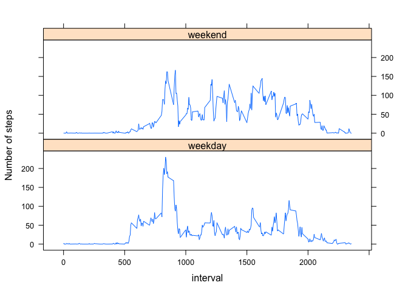

## Loading and preprocessing the data


```r
unzip("activity.zip")
activity <- read.csv("activity.csv", header = TRUE)
head(activity)
```

```
##   steps       date interval
## 1    NA 2012-10-01        0
## 2    NA 2012-10-01        5
## 3    NA 2012-10-01       10
## 4    NA 2012-10-01       15
## 5    NA 2012-10-01       20
## 6    NA 2012-10-01       25
```


## What is mean total number of steps taken per day?

#### 1) Calculate the total number of steps taken per day

```r
daily_total <- aggregate(steps ~ date, data = activity, sum)
```


#### 2) Make a histogram of the total number of steps taken each day

```r
hist(daily_total$steps, main = "Steps per Day", xlab = "Total Steps per Day", ylab = "Number of Days")
```

<!-- -->


#### 3) Calculate and report the mean and median of the total number of steps taken per day

```r
mean(daily_total$steps, na.rm = TRUE)
```

```
## [1] 10766.19
```

```r
median(daily_total$steps, na.rm=TRUE)
```

```
## [1] 10765
```


## What is the average daily activity pattern?

#### 1) Make a time series plot (i.e. \color{red}{\verb|type = "l"|}type="l") of the 5-minute interval (x-axis) and the average number of steps taken, averaged across all days (y-axis)

```r
steps_interval <- aggregate(steps ~ interval, data = activity, mean)
plot(steps_interval$interval, steps_interval$steps, type="l", xlab = "5 min - interval", ylab = "Average steps", main = "Average Daily Activity Pattern")
```

<!-- -->


#### 2) Which 5-minute interval, on average across all the days in the dataset, contains the maximum number of steps?

```r
steps_interval$interval[which.max(steps_interval$steps)]
```

```
## [1] 835
```


## Imputing missing values

#### 1) Calculate and report the total number of missing values in the dataset


```r
sum(is.na(activity$steps))
```

```
## [1] 2304
```


#### 2) Strategy for filling in all of the missing values in the dataset

##### A) Load the dplyr library

```r
library(dplyr)
```


##### B) Replace NA with mean of its corresponding interval.

```r
impute.mean <- function(x) replace(x, is.na(x), mean(x, na.rm = TRUE))
```


#### 3) Create a new dataset that is equal to the original dataset but with the missing data filled in.

```r
NoNA_activity <- activity %>% group_by(interval) %>% mutate(steps = impute.mean(steps))
```


#### 4) Make a histogram of the total number of steps taken each day. 

```r
NoNA_daily_total <- aggregate(steps ~ date, data = NoNA_activity, sum)
hist(NoNA_daily_total$steps, main = "Steps per Day", xlab = "Total Steps per Day", ylab = "Number of Days")
```

<!-- -->


#### 5) Calculate and report the mean and median total number of steps taken per day.

```r
mean(NoNA_daily_total$steps)
```

```
## [1] 10766.19
```

```r
median(NoNA_daily_total$steps)
```

```
## [1] 10766.19
```


## Are there differences in activity patterns between weekdays and weekends?

#### 1) Create a new factor variable in the dataset with two levels – “weekday” and “weekend” indicating whether a given date is a weekday or weekend day.

```r
NoNA_activity$weekend <- "weekday"
NoNA_activity$weekend[weekdays(as.Date(NoNA_activity$date)) %in% c("Saturday", "Sunday")] <- "weekend"
NoNA_activity$weekend <- as.factor(NoNA_activity$weekend)
head(NoNA_activity)
```

```
## # A tibble: 6 x 4
## # Groups:   interval [6]
##    steps date       interval weekend
##    <dbl> <fct>         <int> <fct>  
## 1 1.72   2012-10-01        0 weekday
## 2 0.340  2012-10-01        5 weekday
## 3 0.132  2012-10-01       10 weekday
## 4 0.151  2012-10-01       15 weekday
## 5 0.0755 2012-10-01       20 weekday
## 6 2.09   2012-10-01       25 weekday
```


#### 2) Make a panel plot containing a time series plot (i.e. \color{red}{\verb|type = "l"|}type="l") of the 5-minute interval (x-axis) and the average number of steps taken, averaged across all weekday days or weekend days (y-axis)

```r
library(lattice)
```


```r
steps_interval <- aggregate(NoNA_activity$steps, list(interval = NoNA_activity$interval, weekend = NoNA_activity$weekend), mean)
xyplot(x ~ interval | weekend, data = steps_interval, layout = c(1, 2), type = "l", ylab = "Number of steps")
```

<!-- -->
